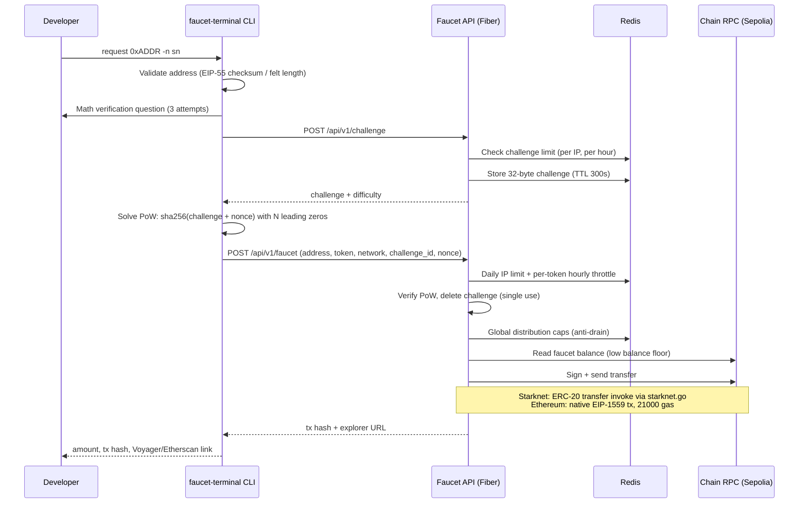

# faucet-terminal

Getting testnet tokens usually means leaving your editor, finding a faucet site that is not empty, passing a CAPTCHA, and pasting your address into a web form. faucet-terminal removes that context switch: it is a CLI that requests Starknet Sepolia and Ethereum Sepolia tokens from a hosted faucet API, so funding a dev wallet is one command in the terminal you are already in.

[](https://www.npmjs.com/package/faucet-terminal)
[](https://www.npmjs.com/package/faucet-terminal)
[)](https://www.npmjs.com/package/starknet-faucet)
[](go.mod)
[](LICENSE)

The project started on npm as [`starknet-faucet`](https://www.npmjs.com/package/starknet-faucet) (Starknet only). Ethereum Sepolia support landed in a short-lived intermediate package, `faucet-cli` v1.0.18, since unpublished, and the project settled on `faucet-terminal` at v2.0.0. Install `faucet-terminal`; the older packages are deprecated or gone, and the stale deprecation notice on `starknet-faucet` still points at the middle name.

## Quickstart

```bash
npm install -g faucet-terminal
faucet-terminal request 0xYOUR_ADDRESS --network starknet
faucet-terminal quota -n sn
```

The first command downloads a prebuilt Go binary for your platform. The second requests STRK for your address (answer one math question, then the CLI solves a proof of work challenge, typically 30 to 60 seconds). The third shows how much daily quota you have left.

## What it is

faucet-terminal is a thin Go client for a hosted faucet service. The same repository contains both halves:

- `cmd/cli`: the CLI published to npm. It validates your address locally, solves a SHA-256 proof of work challenge, and calls the faucet HTTP API.
- `cmd/server`: the faucet API (Go Fiber + Redis) that enforces rate limits, verifies the proof of work, and signs real transactions from a funded faucet wallet on each chain.

You only need the CLI. The server section matters if you want to run your own faucet.

## Architecture

One token request travels through the following path. Every step below is implemented in this repository (`pkg/cli` for the client side, `internal/` and `chains/` for the server side).



Design notes, all from the code:

- Challenges are random 32-byte values generated server side (`internal/pow`), stored in Redis with a 300 second TTL, and deleted after one use so a solution cannot be replayed.
- The client solver (`pkg/cli/pow`) brute forces nonces single threaded and gives up after 500 million attempts.
- The server refuses a transfer that would drop the faucet wallet below a configured percentage of its current balance (`min_balance_protect_pct`, 5 in the shipped configs).
- Chain support is behind a `chains.Chain` interface (`chains/chain.go`); each network implements transfer, balance, validation, and explorer URLs.

## Commands

Every command has a short alias. `<address>` is your wallet address on the selected network.

| Command | Aliases | What it does |
|:--|:--|:--|
| `request <address>` | `req`, `r` | Request tokens. Runs verification, solves PoW, submits the request. |
| `status <address>` | `s` | Check whether an address can request now. |
| `info` | `i` | Show faucet network info, limits, PoW difficulty, and live faucet balances. |
| `quota` | `q` | Show your remaining daily quota and per-token throttle status. |
| `limits` | `l` | Print the rate limit rules. |

```bash
faucet-terminal request 0x123...abc --network ethereum          # ETH on Ethereum Sepolia
faucet-terminal req 0x123...abc -n sn                           # STRK on Starknet Sepolia
faucet-terminal req 0x123...abc -n sn --token ETH               # ETH on Starknet Sepolia
faucet-terminal status 0x123...abc -n eth
faucet-terminal info -n sn --json
```

## Options

| Flag | Short | Scope | Description |
|:--|:--|:--|:--|
| `--network` | `-n` | global | Network to use. Required by `request`, `status`, `info`, and `quota`. |
| `--token` | | `request` | Token to request: `STRK` or `ETH`. Defaults to STRK on Starknet, ETH on Ethereum. |
| `--json` | | global | Machine readable output. Also skips the interactive math question and banner. |
| `--version` | `-v` | root | Print the CLI version. |
| `--help` | `-h` | global | Show help for any command. |

Environment variable:

| Variable | Effect |
|:--|:--|
| `FAUCET_API_URL` | Point the CLI at a different faucet API (for example your own deployment). Release binaries ship with a default API URL baked in at build time. |

## Networks and tokens

| Network | Value for `-n` | Aliases | Tokens |
|:--|:--|:--|:--|
| Starknet Sepolia | `starknet` | `sn`, `stark`, `sn-sep` | STRK (default), ETH |
| Ethereum Sepolia | `ethereum` | `eth`, `eth-sep` | ETH |

Amounts per request are server configuration, not CLI configuration. The chain configs in this repository set 2 STRK and 0.001 ETH per request; the deployed service may differ. Run `faucet-terminal info -n <network>` to see the live per-request amounts and current faucet balances, and read the amount in the response after each request.

Address validation happens before any network call: Ethereum addresses must be exactly 40 hex characters and pass EIP-55 checksum validation when mixed case is used; Starknet addresses accept 1 to 64 hex characters (felt format). The CLI also detects when an address shape does not match the chosen network and tells you which network to use instead.

## Rate limits

Enforced server side in Redis, keyed by IP:

- 5 faucet requests per day per IP, with a 24 hour cooldown once the limit is hit.
- 1 request per hour per token per network (Starknet ETH and Ethereum ETH are throttled separately).
- A cap on PoW challenge requests per hour per IP (10 in the shipped config).
- Global anti-drain caps on total tokens distributed per hour and per day, per token.
- A balance floor: the faucet stops sending when a transfer would take its wallet below the protection threshold.

Errors come back with a typed prefix so scripts can pattern match: `[HOURLY LIMIT]`, `[DAILY LIMIT]`, `[CHALLENGE LIMIT]`, `[FAUCET LIMIT]`, `[LOW BALANCE]`.

## Running your own faucet

The server needs Redis, an RPC endpoint per chain, and a funded wallet per chain. Secrets come from `.env` (`STARKNET_RPC_URL`, `STARKNET_PRIVATE_KEY`, `STARKNET_ADDRESS`, `ETHEREUM_RPC_URL`, `ETHEREUM_PRIVATE_KEY`, `ETHEREUM_ADDRESS`, `REDIS_URL`); non-secret tuning lives in `config/config.json` and `chains/*/config.json`. Dockerfiles and a compose file are in `deployments/`. Setting `FAUCET_TEST_MODE=true` on the server loads `config/config.test.json` with relaxed limits and lower PoW difficulty. Point the CLI at your instance with `FAUCET_API_URL`.

## Limitations

Read this before depending on the tool.

- Two networks only: Starknet Sepolia and Ethereum Sepolia. No mainnet, no other testnets, and no ERC-20s beyond STRK and ETH.
- The CLI is a client to a hosted service. If the hosted faucet is down, empty, or discontinued, the CLI has nothing to talk to. A source build defaults to `http://localhost:8080` unless `FAUCET_API_URL` is set, because the production API URL is injected into release binaries at build time and is not in the source.
- The repository does not compile as published: `pkg/cli/captcha/questions.go` is gitignored (the maintainer keeps the verification questions private) and the package is absent from the tree, so `go build ./...` fails on the CLI package. The server builds and runs; a from-source CLI build requires writing that package yourself.
- `npm install` runs a postinstall script that downloads a prebuilt binary from GitHub Releases for your platform (macOS amd64/arm64, Linux amd64/arm64, Windows amd64). There is no checksum or signature verification of the download.
- Rate limits are per IP. Offices, universities, and CI runners behind one NAT share a single 5-per-day quota, and the server reads the connecting IP directly.
- The math question is client side and is skipped entirely in `--json` mode, so it slows down humans, not scripts. The real anti-abuse cost is the PoW, which is single threaded, takes roughly 30 to 60 seconds at the production difficulty, and aborts after 500 million attempts.
- A hidden `request` flag can skip verification, but the server only accepts its magic nonce when running with `FAUCET_TEST_MODE=1`, so it is inert against production.
- The pretty output of `quota` parses an `hourly_throttle` field, while the server in this tree returns `hourly_throttle_by_network`. Against a server built from this repository the formatted view can fail; `quota --json` always works.
- `limits` prints hardcoded text (10 STRK, 0.01 ETH per request) that does not match the chain configs in this repository (2 STRK, 0.001 ETH). Treat `info` as the source of truth for amounts.
- The hosted API has run on free tiers: the challenge fetch retries 502/503 responses up to 3 times with 60 second waits, but the other commands (`status`, `info`, `quota`, the token request itself) fail immediately against a sleeping server. A scheduled GitHub Action pings the service every 5 minutes to keep it awake; the first request after an idle period can still be slow.
- `info` and `status` validate the `--network` flag locally but never transmit it to the API, and the server in this tree defaults to Starknet. Against a server built from this repository, `info -n eth` returns Starknet data.

## Contributing

See [CONTRIBUTING.md](CONTRIBUTING.md). Bug reports and network requests go to [issues](https://github.com/Giri-Aayush/faucet-terminal/issues).

## License

MIT. See [LICENSE](LICENSE).
